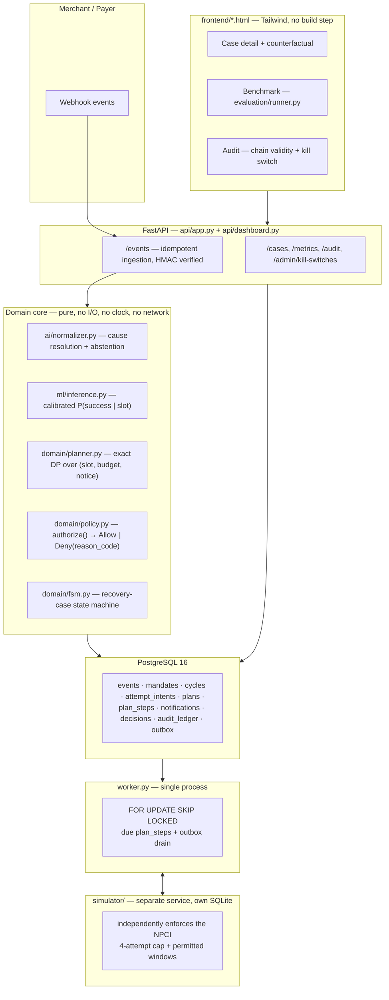

# Mandate Recovery Engine

"You get four attempts. Spend them well."

**Start reading at [`backend/app/domain/planner.py`](backend/app/domain/planner.py)** — the pure,
~160-line backward-induction solver at the core of the system. Everything upstream feeds it
probabilities; everything downstream executes and audits what it decides.

Built for the Razorpay AI Buildathon 2026, Track 03 (AI Revenue Recovery).

**Live demo:** [mandate-recovery-engine.vercel.app/dashboard/index.html](https://mandate-recovery-engine.vercel.app/dashboard/index.html)
— a read-first browsing surface over a once-seeded demo dataset, not a live
transactional environment; see [`docs/DEPLOY.md`](docs/DEPLOY.md) for exactly
what that means and doesn't.

### Quick start (fully live, local — three commands, no cloud account)

```bash
make dev              # create venv, install deps
make up                # start Postgres, run migrations
make demo-seed         # seed a curated, repeatable demo scenario
```

Then, in a second terminal: `.venv/bin/python -m uvicorn app.api.app:app --app-dir backend --reload`
and open `http://localhost:8000/dashboard/index.html`. Full detail, including the other
`make` targets (`make check`, `make bench`, `make replay-fixed`) and what each curated demo case
shows, is in the Setup section below.

---

## 1. Problem

Indian recurring payments such as UPI AutoPay and eNACH operate under tighter recovery constraints
than a generic retry loop: RBI and NPCI rules impose limits on execution windows, pre-debit notice,
and the number of recovery attempts. That turns a failed recurring payment into a constrained
decision problem. A fixed D+1/D+3/D+7 schedule is a natural baseline, but it does not account for
payer-specific success probability or the cost of spending a limited attempt budget at the wrong time.

## 2. Why it matters

A failed recurring payment is not necessarily a willingness-to-pay problem. A payer may simply be
unable to fund the payment at the moment the debit is attempted. For a recurring mandate, that
creates a broader retention problem: losing the mandate can mean losing future recurring payments,
not just the current cycle.

## 3. Solution

A constrained retry-budget planner: given a decline, canonicalise the cause, estimate calibrated
P(success) for each legally permitted future slot over a 14-day horizon, then solve exactly, by
backward induction, for a sequence of at most four attempts and their required notices that
maximises expected recovered value. It also has an explicit stopping rule: when continuing is worth
less than escalating, it stops. Every scheduled action is independently re-authorised at execution
time by a pure policy engine, so a planning mistake cannot become an unauthorised debit.

### How it works

```
Failed payment
     ↓
Cause normalization
     ↓
P(success) for future slots
     ↓
Exact recovery planning
     ↓
Policy + compliance check
     ↓
RETRY / WAIT / NOTIFY / STOP
     ↓
Audit + outcome
```
## 4. Why AI and where it deliberately is not

Two narrow, bounded LLM uses, both off the money path:

- **Decline-reason normaliser** ([`app/ai/normalizer.py`](backend/app/ai/normalizer.py)) — dictionary
  → fuzzy match → Claude Haiku 4.5 → `UNKNOWN`. Free-text bank remarks are unbounded; the output
  space (13 canonical causes) is not. The LLM's job is compressing the tail the dictionary
  doesn't cover, not deciding what happens next.
- **Notice generator** ([`app/ai/notice.py`](backend/app/ai/notice.py)): the LLM drafts,
  a deterministic validator decides (RBI-required fields present, every number/date grounded in a
  literal whitelist, no manufactured urgency, per-channel length caps). One repair attempt, then a
  hard fallback to a static, self-consistent template.
  
**Retry timing, attempt count, money movement, policy enforcement, the stopping decision, and
escalation are never AI.** The success-probability model is a
`HistGradientBoostingClassifier` with isotonic calibration, because the planner needs calibrated
probabilities rather than generative guesses. The planner itself is deterministic backward induction
over ~280 states, making the core decision reproducible and independently testable.

The normaliser is also deliberately bounded against prompt injection: its output is restricted to a
13-value enum, and the downstream policy engine controls what any misclassification can do. The
red-team suite includes simulated successful injection attempts to verify that containment.

## 5. Architecture



Two deliberate architecture choices matter most. **Postgres** is the source of truth because the
four-attempt guarantee is enforced at the database layer (`UNIQUE(cycle_id, sequence_no)`), not
left to application logic. **A single worker on a Postgres queue** provides asynchronous execution
without introducing another consistency boundary: the same transaction that reserves an attempt
also enqueues its delivery, so a crash cannot leave the system with a reserved action that was never
enqueued.

## 6. Key workflows

- **W1 Automatic recovery.** Cycle fails → cause normalised → slots scored → plan solved (e.g.
  notice D+1, attempt D+2, notice D+5, attempt D+6, stop) → each step re-authorised independently
  at execution time → an attempt succeeds → remaining steps cancelled → case sealed.
- **W2 Stop and escalate.** Cause looks unrecoverable (e.g. mandate revoked) → the planner values
  every continuation near zero → the stopping rule fires at the DP's own root comparison → **zero
  attempts consumed** → `AWAITING_MANUAL`.
- **W3 Compliance-blocked execution.** The plan wants a debit at D+2, but the D+1 notice never
  actually sent. The policy engine denies at execution time with `RBI_NOTICE_NOT_SATISFIED` —
  independently of what the plan assumed, so the attempt is **not consumed** and the case stays
  `SCHEDULED` for its next pre-planned step. This is the single most important correctness property
  in the system: a planning mistake never becomes an unauthorised debit.
- **W4 Operator review.** The case-detail dashboard screen shows the plan, every slot's
  probability, every denied action with its reason code, the fixed-schedule counterfactual, and the
  full hash-chained ledger.

## 7. Safety model

Three independent layers protect the four-attempt cap, deliberately redundant so a bug in one
never becomes an unauthorised debit:

1. **Database constraint** — `attempt_intents` has `UNIQUE(cycle_id, sequence_no)` with
   `sequence_no BETWEEN 1 AND 4`. Not application logic; Postgres itself rejects a fifth row.
2. **2. **Policy re-check at execution time** — `domain/policy.py`'s `authorize()` independently
   re-verifies attempt budget, execution window, notice freshness (≥24h, ≤7d, covering *this*
   debit), mandate status, opt-out flag, AFA threshold, and both kill switches every single time,
   regardless of what the plan assumed when it was built.
3. **The simulator rejects independently** a separate FastAPI service with its own SQLite store,
   coded independently of the main app, so a bug in one can never silently pass the other
   (`tests/simulator/test_simulator.py::test_store_rejects_a_fifth_attempt_even_bypassing_the_api`).

Idempotency is layered the same way: `events.external_id` is unique at the database level, outbox
delivery is keyed by idempotency key, and the simulator deduplicates on that same key a
duplicate webhook produces exactly one effect no matter which layer catches it first.

## 8. Evaluation

The rigorous, paired benchmark lives in [`evaluation/runner.py`](evaluation/runner.py) every
policy (`fixed`, `greedy`, `mre`, and an `oracle` perfect-information ceiling) runs against the
**same** batch of payers in a **shared realised world** (outcomes are seeded by
`(payer_id, scheduled_for, sequence_no)`, not by which policy is asking), with a nonparametric
paired bootstrap 95% CI on the rupee gap between every pair. The locked run, on the sealed test
split (500 payers, touched exactly once):

| policy | recovered | rate | rupees | attempts |
|---|---:|---:|---:|---:|
| fixed | 481 | 96.2% | 415,700.10 | 685 |
| greedy | 473 | 94.6% | 410,329.34 | 676 |
| mre | 474 | 94.8% | 412,213.85 | 685 |
| oracle | 475 | 95.0% | 411,238.50 | 682 |

Full report, generated by script (not by hand): [`reports/BENCHMARK.md`](reports/BENCHMARK.md).

### An important result

On the locked test split, the simple fixed schedule recovered more gross rupees than MRE. We did
not hide or tune around that result.

We investigated the gap. MRE explicitly prices the risk that additional low-probability contacts
can lead to opt-out or mandate loss, while this benchmark evaluates a single recovery cycle and
does not model long-term payer churn. That means the benchmark can measure immediate recovery, but
cannot fully credit the long-term benefit that the stopping/hazard term is intended to capture.

There is also an important data limitation: the benchmark uses a synthetic payer world rather than
real production transaction data. The comparison is therefore evidence about behaviour within this
controlled environment, not proof of production uplift.

For the same reason, the project's claim is deliberately narrow: **MRE is a constrained, auditable
recovery planner, not a claim that this MVP universally beats a fixed retry schedule.**

### Simpler-baseline check

We also tested whether a deterministic `(cause, day-of-month)` lookup table could replace the learned
success model. On the development split, the lookup table was essentially indistinguishable from
the fixed baseline and significantly behind MRE. This suggests the useful distinction is not simply
"having a probability estimate", but using that estimate inside a planner that allocates a limited
attempt budget.

The full methodology, confidence intervals, dev/test separation, sensitivity analysis, and
investigation of the locked result are in [`reports/BENCHMARK.md`](reports/BENCHMARK.md).

| policy | recovered | rate | rupees | attempts |
|---|---:|---:|---:|---:|
| fixed | 473 | 94.6% | 493,824.01 | 670 |
| greedy | 467 | 93.4% | 491,645.96 | 672 |
| lookup | 469 | 93.8% | 493,814.67 | 672 |
| mre | 476 | 95.2% | 500,562.70 | 682 |
| oracle | 476 | 95.2% | 498,514.74 | 681 |

`lookup` lands essentially on top of `fixed` (mean gap ₹0.02/payer, 95% CI [-17.80, 16.13] —
indistinguishable) and slightly *ahead* of `greedy` (not significant). Against `mre`, the gap is
real: **lookup - mre = -₹13.50/payer, 95% CI [-28.32, -1.14], significant** the same magnitude
and significance as `fixed`'s gap to `mre` on this split. Robust across the E_MANUAL sensitivity
sweep ({100, 150, 250} `lookup`'s numbers don't move at all, since the table doesn't depend on
E_MANUAL; `mre`'s edge over it holds throughout). Full report:
[`reports/dev/BENCHMARK.md`](reports/dev/BENCHMARK.md) (`make bench`'s own default output path,
kept separate from the locked `reports/BENCHMARK.md` above by construction — see
`evaluation/runner.py --out-dir`'s docstring for why that split-namespaced default exists).

Read plainly: a naive table over the two most obvious variables captures almost nothing beyond
`fixed`'s blind schedule it does not "capture a lot," on this problem, at this population scale.
The real, statistically significant edge is between `mre`/`oracle` and everything simpler
(`fixed`, `greedy`, `lookup` all cluster together), which is a materially stronger answer to "could
deterministic code replace this?" than the plan's own anticipated fallback ("if the GBM beats it by
little, say so") here it beats it by a lot, on the one axis (`dev`-split timing optimisation) this
benchmark can actually measure. This doesn't rescue Section 8's locked test-split result (`fixed`
still wins there on gross rupees, for the hazard-pricing reasons explained above) — P0b wasn't run
against the sealed split and won't be, by the same discipline. It does answer the red-team question
this exercise was built to pre-empt.

## 9. Metrics

Generated by script, not by hand: [`reports/BENCHMARK.md`](reports/BENCHMARK.md) (benchmark) and
[`reports/calibration.png`](reports/calibration.png) + `reports/calibration_metrics.json`
(success-model calibration — the GBM was already well-calibrated out of the box, ECE ≈1.2%;
isotonic calibration provided no measurable benefit at this corpus size and was kept anyway per
"The calibration result is also reported as measured: ECE is approximately 1.2%, and isotonic
calibration did not provide a measurable improvement at this corpus size." not tuned until it looked better).
Live operational metrics in Prometheus text format at `GET /metrics`: cases by state, attempts
consumed, policy denials by reason code, decline-cause normalization source counts (dictionary vs.
fuzzy vs. LLM vs. abstained), notice generation source counts, and validator repair count.

Screenshots of all three dashboard screens (case detail, benchmark, audit — captured against a
freshly-seeded demo, zero console errors): [`docs/screenshots/`](docs/screenshots/). Timed
5-minute submission-video script: [`docs/DEMO_SCRIPT.md`](docs/DEMO_SCRIPT.md).

## 10. Setup / testing / limitations / future work

### Setup (three commands, no cloud account)

```bash
make dev              # create venv, install deps
make up                # start Postgres, run migrations
make demo-seed         # seed a curated, repeatable demo scenario (see below)
```

Then in a separate terminal: `.venv/bin/python -m uvicorn app.api.app:app --app-dir backend --reload` (run from the
repo root) and visit `http://localhost:8000/dashboard/index.html`.

`make demo-seed` wipes and reseeds three hand-picked cases, one per docs I.5 workflow
`CYC-0-RECOVERY` (W1, automatic recovery), `CYC-0-HOPELESS` (W2, stop-and-escalate see
`scripts/demo_seed.py`'s docstring for an honesty note on how this one is constructed),
`CYC-0-BLOCKED` (W3, the compliance-blocked "demo failure", sorted to the top of the case list)
plus 40 `dev`-split synthetic payers through the same live ingestion path, so the dashboard doesn't
look suspiciously empty. Run it right before a live demo/recording, not hours in advance: `make test`
also truncates these tables via the integration test fixtures. All three dashboard screens were
verified in an actual headless browser (Chrome via CDP, not just curl) case-list click-through,
the benchmark screen's dynamic honesty note, and a live kill-switch activate/deactivate round trip
zero console errors. For the full aggregate-statistics replays instead: `make seed-payers` then
`make replay-fixed` (P0 only) or `make replay-compare` (all three live policies, 300 payers each).

```bash
make check             # lint + strict mypy + full test suite
make bench              # the paired benchmark (dev split; --split test is the one locked run)
make demo-predictability   # standalone proof the timing signal is real, no DB needed
```

### Testing

`make check` runs Ruff, mypy in strict mode, and the full pytest suite (`make test` alone for just
tests) 212 tests as of this writing, all deterministic, no network calls in CI (the LLM
components are tested with the real call path mocked at the SDK boundary, not skipped).
`tests/integration/test_chaos.py` and `tests/simulator/` cover the failure matrix explicitly:
duplicate/out-of-order webhook delivery, stale events after case closure, mid-plan mandate
revocation, a simulated successfully-injected LLM, rail 5xx and ambiguous-timeout handling, and the
four-attempt cap enforced from three independent code paths.

### Limitations — named before a reviewer finds them

1. **The balance and credit-day model is naive relative to real payer behaviour.** It's a
   documented, stated causal model (linear balance decay from a modelled credit day, a logistic
   funds-sufficiency function) — not fit to any real transaction data, because MRE has no legitimate
   access to a real payer's bank balance or salary date without their explicit, consented
   Account-Aggregator-mediated authorization (see `docs/SIGNAL_LEGITIMACY.md` for the full
   verified/consent-required/not-available breakdown this was checked, not assumed).
2. **The system optimises each cycle independently**, which is provably suboptimal across a
   mandate's lifetime. The value function accepts a mandate-continuation term
   (`γ · expected_future_value`) as an input but does not compute it `domain/planner.py` says so
   in its own module docstring. A planner that ignores this term will, in principle, sometimes
   burn a mandate to optimise one cycle.
3. **The revocation/opt-out hazard model is currently synthetic.** The planner uses fixed
    `optout_hazard_cost` and `revoke_hazard_cost` parameters rather than a model learned from real
    contact-frequency and churn data. The locked benchmark shows why this matters: the planner's
    long-term hazard trade-off cannot be fully evaluated without a multi-cycle revocation model.
4. **The success model does not currently learn a meaningful decline-cause effect.** The synthetic
    corpus does not encode a causal relationship between decline cause and outcome, so the current
    model's useful signal comes primarily from the timing/balance dynamics. The cause is still carried
    through the live pipeline because a production corpus could make it predictive.

### Out of scope, stated plainly

Voice. Real money. Real Razorpay mandate execution APIs (UPI AutoPay test-mode access was blocked during development;
see `docs/RAZORPAY_TESTMODE_FINDINGS.md` for the verified limitation). Multi-tenant auth. Kubernetes.
A vector database. An agent framework. Card-network specifics. Cross-border. Merchant onboarding.

### Future work

A real, calibrated revocation/opt-out hazard model tied to contact frequency, and a multi-cycle
evaluation metric that can actually credit avoided annoyance — the correct way to test the half of
MRE's value proposition this benchmark's current scope structurally cannot measure (see Section 8).
The mandate-continuation term. An AFA consent flow once Razorpay UPI Autopay test-mode access
unblocks. Per-merchant kill-switch and contact-cap configuration promoted from constants to real
admin-editable state. Making the training corpus's `cause` label causally connected to its
simulated outcome (Limitation 4), then re-running the full locked benchmark once, deliberately,
as a new evaluation — not a silent drift of the existing one.

---

## 11. Where this sits next to Razorpay's own direction

Razorpay's own Agent Studio, launched at FTX'26, ships a production **Subscription Recovery
Agent**: it reads a failed payment's cause, applies retry logic beyond a fixed schedule, and
escalates to a live voice call (ElevenLabs) when retries aren't enough 
[Agent Studio launch](https://razorpay.com/blog/agent-studio-ai-agents-by-razorpay/),
[product page](https://razorpay.com/agent-studio/). MRE was built, and the PRD chosen, before
that launch and independently of it — but it targets a closely related problem that Razorpay itself now considers important enough to productise.
That public product direction is strong external evidence that recurring-payment recovery is a real
problem area for Razorpay, rather than a problem invented solely for the buildathon.

The two systems differ in scope, not in philosophy. Razorpay's own description of Agent Studio's
guardrails "deterministic mathematical guardrails and SHA-256 cryptographic idempotency locks,"
agents that can run in a review-first mode where the agent drafts and a human/deterministic layer
decides before anything executes
([guardrails post](https://razorpay.com/blog/razorpay-agent-studio-principles-guardrails-and-merchant-control/))
is the same split this codebase makes at a fraction of the scale: the LLM drafts (decline
classification, notice text), a deterministic validator and policy engine decide, and money
movement is never something the AI outputs (Section 4, Section 7). MRE has no voice channel, no
merchant-facing guardrail console, and runs against a simulator rather than Razorpay's real rails
it is a research-grade proof of the decision layer (an exact, auditable optimizer under RBI's
4-attempt/notice constraints), not a competing product. The claim is narrower and more useful: 
the architecture we arrived at — bounded AI outputs surrounded
by deterministic validation, policy controls, and auditable execution — closely matches a pattern
Razorpay now describes publicly for its own agent platform.

---

*Full engineering history — every bug found, every architectural decision reconsidered, and why 
is in `CLAUDE.md` (working log), [`docs/ENGINEERING_LOG.md`](docs/ENGINEERING_LOG.md) (the "what
broke" narrative, pulled out on its own), `docs/ADR/` (numbered decision records), and
[`docs/SECURITY_REVIEW.md`](docs/SECURITY_REVIEW.md) (the docs L.3 red-team exercises, run for
real — one of six found a genuine bug, now fixed).*
